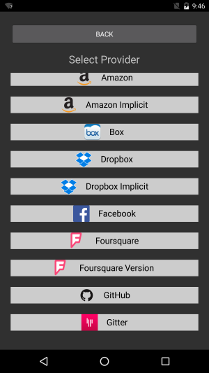
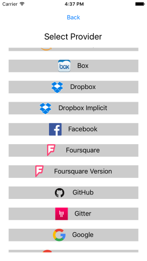

# Xamarin.Forms.OAuth

[](https://gitter.im/Bigsby/Xamarin.Forms.OAuth?utm_source=badge&utm_medium=badge&utm_campaign=pr-badge&utm_content=badge)


# Usage

To use this library, only three steps are needed:

## 0. Register your app with the provider(s)
The link to each provider's registration page is available in the [wiki](https://github.com/Bigsby/Xamarin.Forms.OAuth/wiki).

## 1. Add NuGet Package
Use Package Manager Console to install the library in your Xamrain.Forms (Portable) project.
```bat
PM> Install-Package Xamarin.Forms.OAuth 
```
[NuGet Link](https://www.nuget.org/packages/Xamarin.Forms.OAuth/)

## 2. Add your provider(s)
For instance, in your App.cs file, add your providers:
```cs
public App()
{
  OAuthAuthenticator.AddPRovider(OAuthProviders.Facebook("FacebookAppId"));
  OAuthAuthenticator.AddPRovider(OAuthProviders.Google("GoogleClientId", "RedirectUrlConfiguredInGoogleAppConsole"));
  OAuthAuthenticator.AddPRovider(OAuthProviders.Microsoft("MicrosoftClientId", "RedirectUrlConfiguredInMicrosoftDeveloperApp"));
  
  OAuthAuthenticator.AddPRovider(OAuthProviders.Custom(
    "Name", 
    "https://authorizeUlr", 
    "http://redirectUrl", 
    "http://accountUrl", 
    "ClientId", 
    logo: ImageSource.FromUri("http://logUrl.png"));
  
  // The root page of your application
  // ...
}
```

## 3. Call for authentication when you need it:
```cs
var authenticationResult = await OAuthAuthenticator.Authenticate();

if (authenticationResult)
{
  var providerName  = authenticationResult.Account.Provider;
  var accountId = authenticationResult.Account.Id;
  var accountDisplayName = authenticationResult.Account.DisplayName;
  var accessToken = authenticationResult.Account.AccessToken;
  // ...
}
else
{
  var errorMessage = authenticationResult.ErrorMessage;
  // ...
}
```

## 3a. Inject provider manually
If only one provider is used or if a custom provider selection outside this library is used, authentication can be invoked with the intended provider:
```cs
var authenticationResult = await OAuthAuthenticator.Authenticate(OAuthProvider.Facebook("FacebookAppId"));

if (authenticationResult)
{
  // ...
}
else
{
  var errorMessage = authenticationResult.ErrorMessage;
  // ...
}
```

## 4. Resouce Access
The account in the result can be used to access the provider's result taking care of all the OAuth parameters injection (Post is also available):
```cs
// GET
var authenticationResult = await OAuthAuthenticator.Authenticate(OAuthProvider.Facebook("FacebookAppId"));
var resourceString = await authenticationResult.Account.GetResource<string>("https://graph.facebook.com/v2.5/me");
// or
var resourceJObject = await authenticationResult.Account.GetResource<JObject>("https://graph.facebook.com/v2.5/me");
// or
var resourceType =  = await authenticationResult.Account.GetResource<ResourceType>("https://graph.facebook.com/v2.5/me");

// or POST
var httpContent = new StringContent("to send to API"); // can be any type deriving from System.Net.Http.HttpContent
var resource = await authenticationResult.Account.PostToreResource<string>("resourceUrl", httpContent);
// same deserialization of response can be handle as above
```

## 5. Refresh Token
If the provider supports it and a refresh token was provided, theh access token can be refreshed:
```cs
var authenticationResult = await OAuthAuthenticator.Authenticate(OAuthProvider.Facebook("FacebookAppId"));
if (authenticationResult.Account.RefreshesToken 
    && authenticationResult.Account.AccessToken.Expires.HasValue 
    && authenticationResult.Account.AccessToken.Expires.Value - DateTime.Now < TimeSpan.FromMinutes(5))
  {
    var response = await result.Account.RefreshToken();
    if (response)
    {
      // if this is reached, result.Account.AccessToken will be updated with new token and expiration DateTime
    }
    else
    {
      //Handle error using response.Error and response.ErrorDescription
    }
  }
  // 
```

# Customization
A set of customizations are provided. Here is their usage.

## Select Provider Text
```cs
OAuthAuthenticator.SetProviderSelectText("Pick one:"));
```

## Back Button Text
```cs
OAuthAuthenticator.SetBackButtonText("Go Back!"));
```

## Provider's Button Styling
```cs
OAuthAuthenticator.SetProviderButtonBackground(Color.Red));
OAuthAuthenticator.SetProviderButtonTextColor(Color.FromHex("FFFF00")));
OAuthAuthenticator.SetProviderButtonFontSize(38));
```

# Screenshots




# Supported Providers

Here is the list of the OAuth providers suported out-of-the-box (20):
* Amazon
* Box
* Dropbox
* Facebook
* Foursquare
* GitHub
* Gitter
* Google
* Instagram
* LinkedIn
* Microsoft
* PayPal
* ReddIt
* Salesforce
* Slack
* SoundCloud
* StackExchange
* Visual Studio Online
* Meetup
* Trello

# Future Features
These are the features that will be impleneted next:
* Implement more providers (feel free to suggest):
  * Atlassian products (JIRA, Bamboo, Bitbucket)
  * Skype for Business
  * Microsft Graph
* Feel free to point buts or any feature or provider you would like implemented on  [](https://gitter.im/Bigsby/Xamarin.Forms.OAuth?utm_source=badge&utm_medium=badge&utm_campaign=pr-badge&utm_content=badge)
