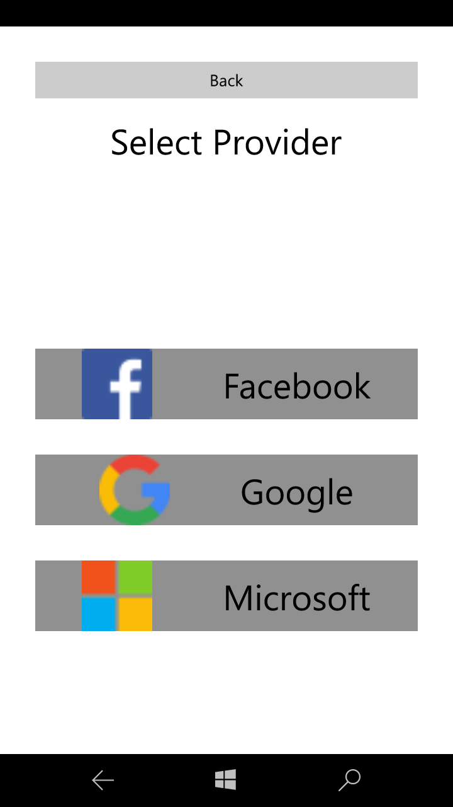

# Xamarin.Forms.OAuth
Xamarin.Forms library to authenticate against OAuth endpoints


# Usage

To use this library, only three steps are needed:

## 1. Add NuGet Package
Use Package Manager Console to install the library in your Xamrain.Forms (Portable) project.
```bat
PM> Install-Package Xamarin.Forms.OAuth 
```
[NuGet Link](https://www.nuget.org/packages/Xamarin.Forms.OAuth/)

## 2. Add your providers
For instance, in your App.cs file, add your providers:
```cs
public App()
{
  OAuthAuthenticator.AddPRovider(OAuthProviders.Facebook("FacebookAppId"));
  OAuthAuthenticator.AddPRovider(OAuthProviders.Google("GoogleClientId", "RedirectUrlConfiguredInGoogleAppConsole"));
  OAuthAuthenticator.AddPRovider(OAuthProviders.Microsoft("MicrosoftClientId", "RedirectUrlConfiguredInMicrosoftDeveloperApp"));
  
  OAuthAuthenticator.AddPRovider(OAuthProviders.Custom(
    "Name", 
    "https://authorizeUlr", 
    "http://redirectUrl", 
    "http://accountUrl", 
    "ClientId", 
    logo: ImageSource.FromUri("http://logUrl.png"));
  
  // The root page of your application
  // ...
}
```

## 3. Call for authentication when you need it:
```cs
var authenticationResult = await OAuthAuthenticator.Authenticate();

if (authenticationResult)
{
  var providerName  = authenticationResult.Account.Provider;
  var accountId = authenticationResult.Account.Id;
  var accountDisplayName = authenticationResult.Account.DisplayName;
  var accessToken = authenticationResult.Account.AccessToken;
  // ...
}
else
{
  var errorMessage = authenticationResult.ErrorMessage;
  // ...
}
```

## 3a. Inject provider manually
If only one provider is used or if a custom provider selection outside this library is used, authentication can be invoked with the intended provider:
```cs
var authenticationResult = await OAuthAuthenticator.Authenticate(OAuthProvider.Facebook("FacebookAppId"));

if (authenticationResult)
{
  // ...
}
else
{
  var errorMessage = authenticationResult.ErrorMessage;
  // ...
}
```

# Screenshot


# Supported Providers

Here is the list of the OAuth providers suported out-of-the-box:
* Amazon
* Box
* Dropbox
* Facebook
* GitHub
* Google
* Instagram
* Microsoft

Implemented but not tested:
* LinkedIn
* ReddIt
* StackExchange
* Twitter


# Future Features
These are the features that will be impleneted next:
* Implement token refresh
* Feel free to point buts or any feature you would like implemented
